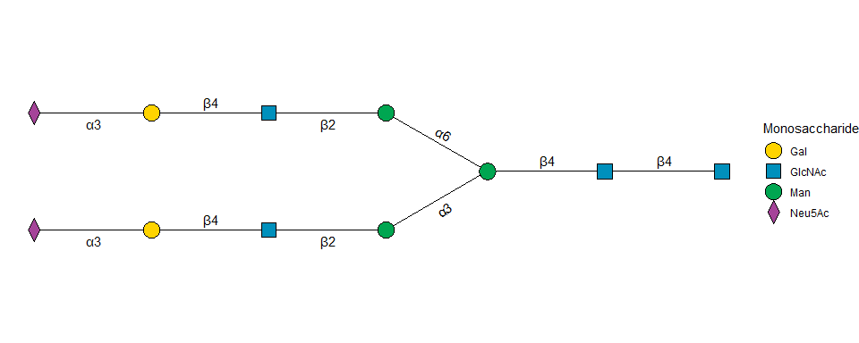
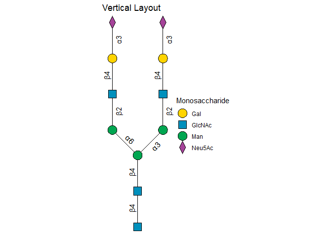
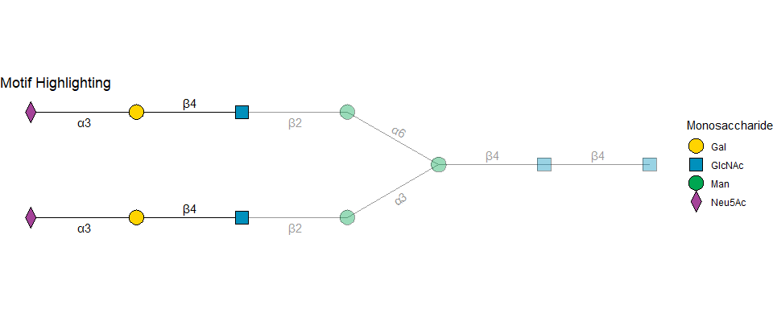

# gglycan: Grammar of Graphics for Glycans


<!-- README.md is generated from README.qmd. Please edit that file -->

# gglycan

The goal of `gglycan` is to provide a `ggplot2`-compatible framework for
visualizing glycan structures (N-glycans, O-glycans, etc.) using the
standard SNFG (Symbol Nomenclature for Glycans) style. It leverages
`ggtangle` for network layout and `ggstar` for SNFG symbols.

## Installation

You can install the development version of gglycan like so:

``` r
# install.packages("devtools")
devtools::install_github("YuLab-SMU/gglycan")
```

## Example

This is a basic example which shows you how to plot a complex N-glycan:

``` r
library(ggplot2)
library(gglycan)

# Define a glycan using IUPAC condensed string
s <- "Neu5Ac(a2-3)Gal(b1-4)GlcNAc(b1-2)Man(a1-3)[Neu5Ac(a2-3)Gal(b1-4)GlcNAc(b1-2)Man(a1-6)]Man(b1-4)GlcNAc(b1-4)GlcNAc"

# Plot with default SNFG style and layout
gglycan(s) + 
  geom_glycan()
```



## Custom Layouts

`gglycan` supports flexible layouts. You can change the growth direction
(`left`, `right`, `up`, `down`) and adjust branching angles.

``` r
# Vertical layout growing upwards
gglycan(s, direction = "up", angle_sep = 45) + 
  geom_glycan() + 
  ggtitle("Vertical Layout")
```



## Motif Highlighting

You can highlight specific substructures (motifs) within a glycan. The
motif remains fully opaque, while the rest of the structure is dimmed.

``` r
# Highlight the Sialyl-Lewis x like motif
motif <- "Neu5Ac(a2-3)Gal(b1-4)GlcNAc"

gglycan(s, motif = motif) + 
  geom_glycan() + 
  ggtitle("Motif Highlighting")
```



## Key Features

- **IUPAC Parsing**: Reads standard condensed IUPAC strings.
- **SNFG Standards**: Automatic mapping of monosaccharides to SNFG
  shapes and colors.
- **Fishbone Layout**: Custom layout algorithm mimicking textbook-style
  glycan drawings (symmetric Y-splits, orthogonal extension).
- **Motif Highlighting**: Easy identification of substructures.
- **ggplot2 Extension**: Fully compatible with `ggplot2` layers, themes,
  and scales.
